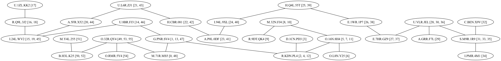
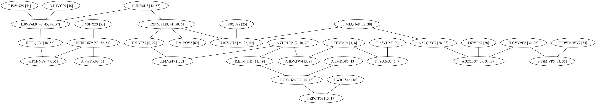
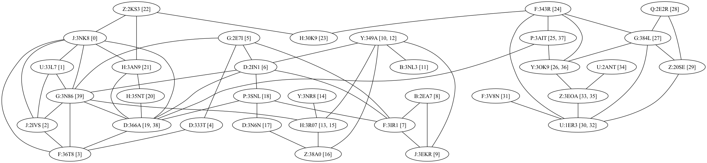

# Frontier Route

## Purpose

Determine the most efficient route to visit all systems in a region, starting at a nominated system. This is an attempt at solving the [Travelling salesman problem](https://en.wikipedia.org/wiki/Travelling_salesman_problem) which is NP-hard with O(V!) complexity, so this will not work for large regions unless you want to wait decades, or even until the heat death of the universe.

## Usage

```
frontier_route --system I.EXP.NJ7 --map map.json
```

## Examples

### Starting at O.32R.QY4 (acyclic)



### Starting at I.EXP.NJ7 (acyclic)



### Starting at G:3N86 (cyclic)


